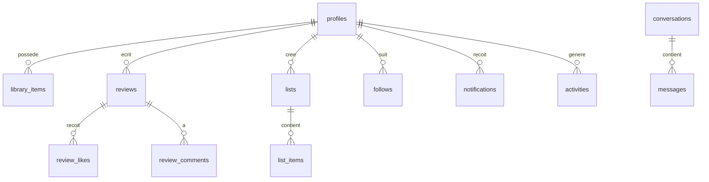
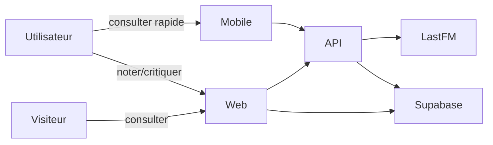
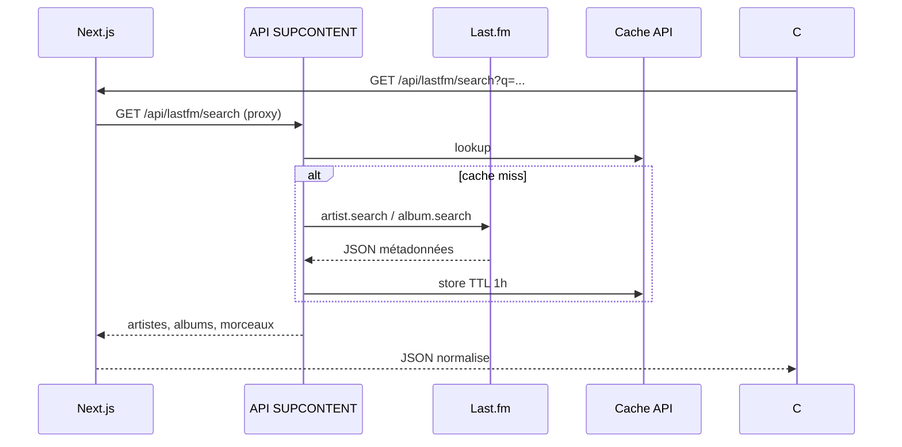

# Documentation technique — SUPCONTENT

## 1. Choix technologiques

| Composant | Choix | Justification |
|-----------|-------|---------------|
| Média | **Last.fm** | API publique gratuite, métadonnées riches (artistes, albums, morceaux, images) |
| API serveur | **Express (Node.js)** | Léger, REST, cache en mémoire, déployable en Docker |
| Client web | **Next.js 16** | SSR, Server Actions, UX fluide pour critiques longues |
| Client mobile | **Flutter** (`mobile/`) — WebView vers l'app Next.js | Réutilise 100 % du web ; pas d'appel direct Last.fm |
| Base de données | **PostgreSQL (Supabase)** | SQL, RLS, auth intégrée, temps réel messagerie |
| Auth | **Supabase Auth** | Email/mot de passe + Google OAuth2 |

## 2. Prérequis et clé API Last.fm

1. Créer un compte sur [last.fm/join](https://www.last.fm/join)
2. Aller sur [last.fm/api/account/create](https://www.last.fm/api/account/create)
3. Copier les variables dans `.env` et `.env.local` :

```
LASTFM_API_KEY=votre_cle
SUPCONTENT_API_URL=http://localhost:4000
NEXT_PUBLIC_SUPABASE_URL=http://127.0.0.1:30001
NEXT_PUBLIC_SUPABASE_ANON_KEY=cle_depuis_npm_run_db_status
```

**Rendu correcteur** : le fichier `.env` peut etre versionne **uniquement si le depot Git reste prive** (consigne enseignant). Ne jamais mettre de secrets en dur dans le code source.

## 3. Installation

```bash
git clone <url-depot-prive>
cd content-discovery-platform
npm install
cp .env.example .env.local
npm run db:start
npm run db:reset
npm run dev:all
```

Ou deux terminaux : `npm run api:dev` puis `npm run dev`.

Mailpit (emails locaux) : http://127.0.0.1:30005  
Studio Supabase : http://127.0.0.1:30004

## 4. Déploiement

### Docker Compose

```bash
docker compose up --build -d
```

| Service | Port | Description |
|---------|------|-------------|
| web | 3000 | Application Next.js |
| api | 4000 | API REST + proxy Last.fm |
| database | 5432 | PostgreSQL |

Variables requises : voir `.env.example`.

### Production

- Héberger l'API et le web sur un PaaS (Railway, Render, Vercel + API séparée)
- Utiliser Supabase Cloud pour auth et BDD
- Configurer les URIs OAuth Google pour l'environnement de production

## 5. Schéma base de données



Tables principales : `profiles`, `library_items` (statuts), `reviews`, `review_likes`, `review_comments`, `lists`, `follows`, `activities`, `notifications`, `reports`, `media_cache`, messagerie (`conversations`, `messages`).

Migrations : `supabase/migrations/`.

## 6. Cas d'utilisation (extrait)



## 7. Séquence — recherche d'un album



## 8. Sécurité

- Secrets uniquement via variables d'environnement
- RLS Supabase sur toutes les tables utilisateur
- Messagerie : abonnement mutuel requis (RPC `get_or_create_direct_conversation`)
- Modération : rôle `is_admin` sur `profiles`

## 9. Structure du dépôt

```
├── app/              # Next.js (client web)
├── server/           # API Express
├── mobile/           # Client Flutter (WebView)
├── supabase/         # Migrations SQL
├── docs/             # Documentation
├── docker-compose.yml
└── Dockerfile
```
