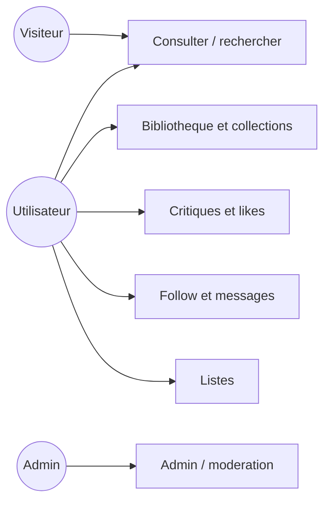
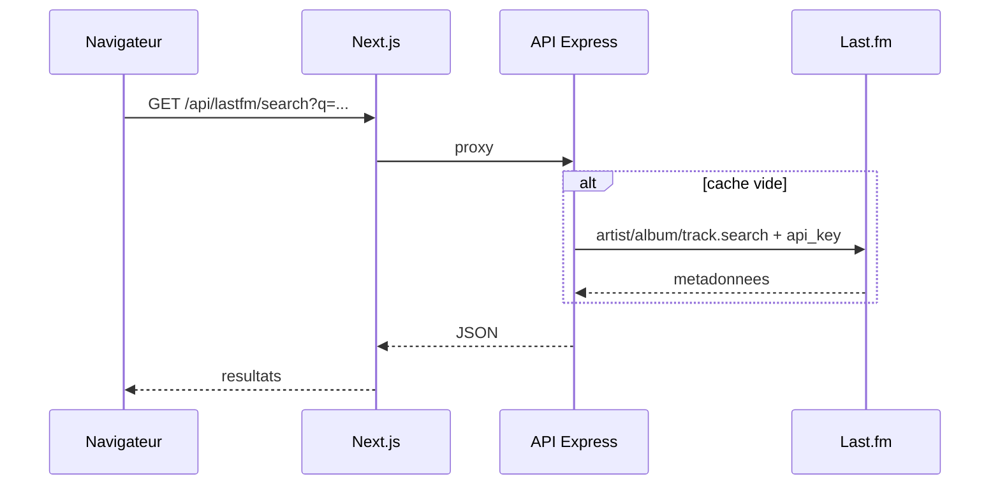
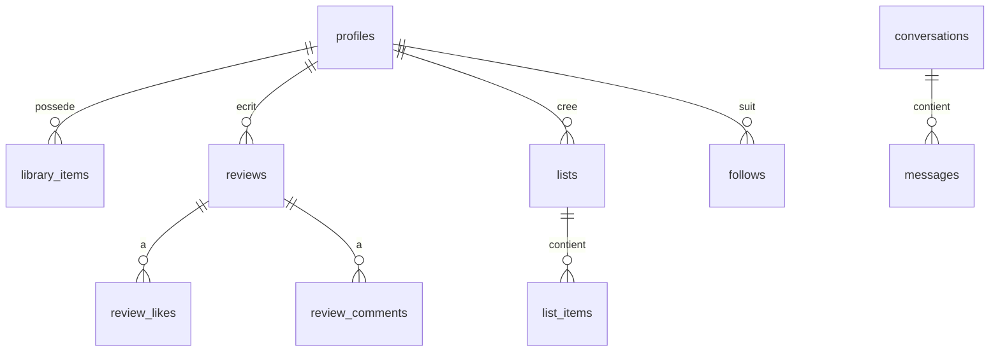

# Documentation technique — SUPCONTENT

Reseau social autour de la musique. Donnees musicales via Last.fm, donnees utilisateurs via Supabase (PostgreSQL).

**Depot Git :** https://github.com/LUCas-dkt/SUPCONTENTT (prive, branche `main`)

---

## Choix techniques

On a decoupe le projet en trois parties :

- **Next.js** (TypeScript) pour le site. On voulait du SSR et une interface reactive pour les critiques, listes, etc.
- **Express** (Node.js) pour l'API qui parle a Last.fm. La cle API reste cote serveur, avec un petit cache memoire (1h).
- **Supabase** pour PostgreSQL, l'authentification et le social (follow, messages, notifications, RLS).
- **Flutter + WebView** pour le mobile : on recharge le site, pas de double code metier.
- **Last.fm** comme API tierce : gratuite, bien documentee, artistes/albums/morceaux/poches sans heberger de fichiers audio.

Auth : email/mot de passe (+ Google OAuth en option sur le web).

---

## Prerequis

- Node.js 20+
- Docker Desktop (pour Supabase local)
- Git
- Cle API Last.fm (obligatoire pour la recherche)
- Flutter 3.12+ si vous testez le mobile

Ports locaux : 3000 web, 4000 API, 30001 Supabase, 30004 Studio, 30005 Mailpit.

---

## Cle API Last.fm

1. Compte sur https://www.last.fm/join
2. Creer une app sur https://www.last.fm/api/account/create
3. Copier la cle dans `.env` :

```
LASTFM_API_KEY=votre_cle
```

Ne jamais mettre cette cle dans le code source. Le fichier `.env` est dans `.gitignore`.

Les valeurs Supabase dans `.env.example` sont celles du Supabase local par defaut (dev uniquement).

---

## Installation

```powershell
git clone https://github.com/LUCas-dkt/SUPCONTENTT.git
cd SUPCONTENTT
npm install
copy .env.example .env
# editer LASTFM_API_KEY
npm run db:start
npm run db:reset
npm run dev:all
```

Alternative : terminal 1 `npm run api:dev`, terminal 2 `npm run dev` (Docker + db:start toujours necessaires).

Mobile : `npm run mobile:run` (emulateur Android, web sur 10.0.2.2:3000).

Plus de details : `RENDU_CORRECTEUR.md`.

---

## Deploiement

**Docker Compose** (web + API + Postgres) :

```powershell
copy .env.example .env
docker compose up --build -d
```

Web : 3000, API : 4000, Postgres : 5432. Pour l'auth complete, Supabase Cloud ou Supabase local a part.

**Production** : heberger l'API (Render, Railway…), le front (Vercel ou Docker), Supabase Cloud pour la BDD. Variables d'environnement pour les secrets. Build Next : `npm run build` puis `npm start`.

---

## Cas d'utilisation



Last.fm sert surtout pour consulter et rechercher. Le reste est en base Supabase.

---

## Sequence — appel Last.fm (recherche)



La cle Last.fm est ajoutee uniquement dans Express (`process.env.LASTFM_API_KEY`).

---

## Base de donnees



Tables : `profiles`, `library_items`, `collections`, `collection_items`, `lists`, `list_items`, `reviews`, `review_likes`, `review_comments`, `follows`, `activities`, `notifications`, `reports`, `media_cache`, messagerie (`conversations`, `conversation_participants`, `messages`).

SQL dans `supabase/migrations/`, seed admin dans `supabase/seed.sql`.

---

## Securite

- Secrets dans `.env` seulement
- RLS sur les tables utilisateur
- Messages : abonnement mutuel requis
- Admin : champ `is_admin` sur `profiles`

---

## Structure du repo

```
app/          Next.js
server/       API Express
mobile/       Flutter WebView
supabase/     migrations SQL
docs/         cette doc + manuel
public/       images, icones
```

Archive pour Moodle : `npm run package:rendu` → `SUPCONTENT-rendu.zip` (sans node_modules ni .env).
